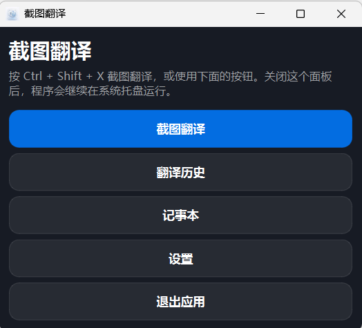
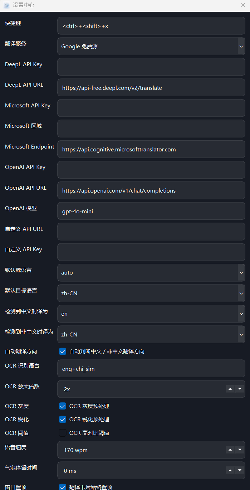
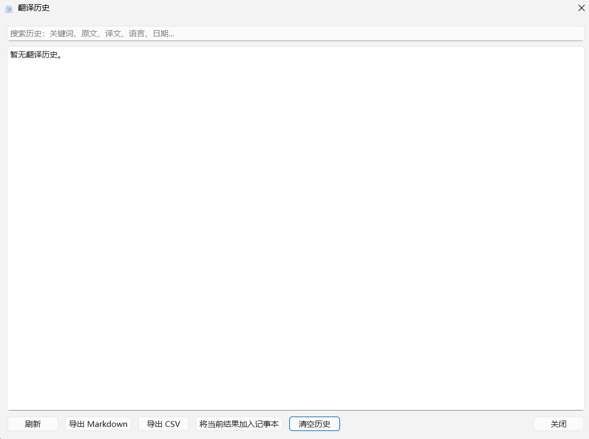

# 截图翻译 Screenshot Translator

一个 Windows 桌面端截图翻译工具，支持全局快捷键截图、OCR 文字识别、多翻译源、语音朗读、翻译历史、记事本摘录和深色毛玻璃 UI。

## 功能亮点

- 全局快捷键截图翻译：默认 `Ctrl + Shift + X`
- 框选屏幕任意区域并自动 OCR 识别文字
- 支持中英互译，也可手动选择源语言和目标语言
- 支持多个翻译源渠道：Google、DeepL、Microsoft Translator、OpenAI、自定义 API
- 支持语音朗读：可朗读原文 / 译文，可选择系统语音
- 支持翻译历史记录、搜索、导出 Markdown / CSV
- 支持记事本摘录，可导出 TXT / Markdown
- 支持 OCR 增强：放大、灰度、锐化、高对比处理
- 支持系统托盘、置顶切换、窗口拖拽和文本区域拖拽调整大小
- 内置应用图标，可打包为 Windows `.exe`

## 项目截图

建议上传项目后，在这里补充几张截图：

```markdown
## 项目截图

### 主界面


### 设置中心


### 翻译历史

```

## 环境要求

- Windows 10 / Windows 11
- Python 3.10 或更高版本
- Tesseract OCR
- 网络连接：在线翻译服务需要联网

## 安装 Tesseract OCR

Windows 推荐安装路径：

```text
C:\Program Files\Tesseract-OCR\tesseract.exe
```

安装后在命令提示符中检查：

```bat
tesseract --version
```

如需识别中文，请确保安装了中文语言包，例如：

```text
chi_sim
```

检查语言包：

```bat
tesseract --list-langs
```

## 快速运行

1. 下载或克隆本项目。
2. 进入项目目录。
3. 双击运行：

```bat
run_windows.bat
```

首次运行会自动安装依赖。

## 手动运行

```bat
pip install -r requirements.txt
python screenshot_translator_app.py
```

## 使用方法

1. 启动程序后，右下角系统托盘会出现应用图标。
2. 按快捷键：

```text
Ctrl + Shift + X
```

3. 用鼠标框选屏幕上的文字区域。
4. 程序会自动 OCR 识别并显示翻译结果。
5. 在翻译窗口中可以：
   - 切换源语言和目标语言
   - 选择翻译服务
   - 朗读原文或译文
   - 保存到历史记录
   - 摘录到记事本
   - 拖动文本区域调整大小
   - 拖动窗口右下角缩放窗口

## 翻译源配置

### Google

默认翻译源，不需要 API Key。

### DeepL

在设置中心填写 DeepL API Key。

### Microsoft Translator

在设置中心填写：

- Azure Translator Key
- Azure Region

### OpenAI

在设置中心填写：

- OpenAI API Key
- 模型名称，例如 `gpt-4o-mini`

### 自定义 API

App 会向你的接口发送：

```json
{
  "text": "要翻译的文本",
  "source": "en",
  "target": "zh-CN"
}
```

你的接口返回以下任一字段即可：

```json
{
  "translation": "译文"
}
```

也支持：

```json
{
  "result": "译文"
}
```

或：

```json
{
  "text": "译文"
}
```

## 打包为 Windows exe

双击运行：

```bat
build_windows.bat
```

生成文件通常位于：

```text
dist\ScreenshotTranslator.exe
```

项目已包含：

- `app_icon.png`
- `app_icon.ico`

打包脚本会使用 `app_icon.ico` 作为 exe 图标。

## 项目结构

```text
screenshot-translator-app/
├─ screenshot_translator_app.py   # 主程序
├─ requirements.txt               # Python 依赖
├─ run_windows.bat                # Windows 运行脚本
├─ run_windows_debug.bat          # Windows 调试运行脚本
├─ build_windows.bat              # Windows exe 打包脚本
├─ app_icon.png                   # 应用图标 PNG
├─ app_icon.ico                   # 应用图标 ICO
├─ README.md                      # 项目说明
├─ GITHUB_UPLOAD_GUIDE.md         # GitHub 上传教程
└─ .gitignore                     # Git 忽略规则
```

## 数据保存位置

程序会在用户目录下保存配置、历史记录和记事本内容，例如：

```text
.screenshot_translator_app_config.json
.screenshot_translator_app_history.json
.screenshot_translator_app_notebook.txt
```

这些文件不会保存在项目目录中，通常不需要上传到 GitHub。

## 注意事项

- 不要把 API Key、Token、密码上传到 GitHub。
- 如果你使用 OpenAI、DeepL、Microsoft Translator 等付费服务，请妥善保管密钥。
- 如果 OCR 识别不准确，可以在设置中心开启 OCR 放大、灰度、锐化、高对比等增强选项。
- 如果快捷键失效，可以通过系统托盘菜单手动启动截图翻译。

## 后续计划

- 增加安装包 `.msi` 或 `.exe installer`
- 增加自动更新
- 增加更多 OCR 引擎，例如 PaddleOCR / EasyOCR
- 增加更多主题和图标选择
- 增加历史记录标签和收藏

## 许可协议

请根据你的发布需求选择开源协议，例如 MIT、Apache-2.0 或 GPL。确定协议后，可以在仓库中添加 `LICENSE` 文件。
